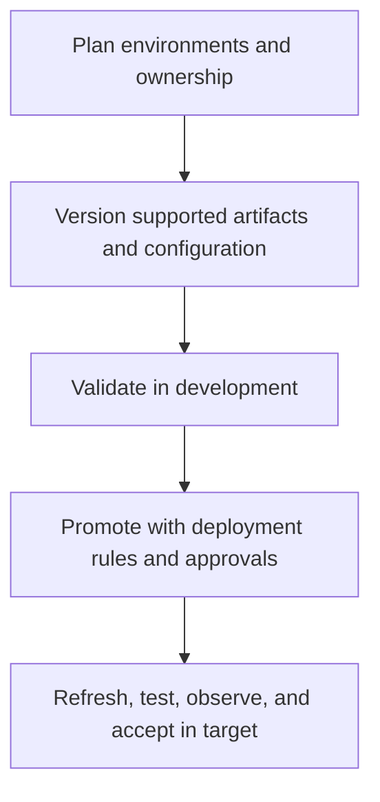

# Deliver with confidence

Treat Fabric content as a versioned product: define the environment strategy, keep supported artifacts under source control, automate repeatable prerequisites, use controlled promotion, and verify the deployed result. Deployment is not complete merely because an artifact appears in the target workspace.

## Delivery model

| Stage | Outcome to verify |
| --- | --- |
| Foundation | Required capacity, workspaces, identities, connections, and policies are prepared consistently. |
| Source control | Supported Fabric artifacts, scripts, and deployment configuration have an auditable change history. |
| Validation | Data contracts, refreshes, notebooks, pipelines, semantic models, security, and reports meet release criteria. |
| Promotion | Deployment stages, ownership, rules, approvals, and target configuration are explicit. |
| Post-deployment | Target data is available, refresh is configured, access is correct, and monitoring confirms expected behavior. |

## Important deployment boundary

The repository's [deployment pipeline demo](https://github.com/Cloud2BR-MSFTLearningHub/Fabric-EnterpriseFramework/blob/main/Deployment-Pipelines/README.md) explains that promotion generally copies item definitions and metadata. For lakehouses, tables and data still need environment-specific refresh or reload procedures. Include that work in the release plan, alongside credentials, connections, parameters, and data-quality validation.

## Source-led practices

- Use the [Terraform examples](https://github.com/Cloud2BR-MSFTLearningHub/Fabric-EnterpriseFramework/tree/main/Terraform) as learning references for repeatable Azure platform prerequisites.
- Review [GitHub integration guidance](https://github.com/Cloud2BR-MSFTLearningHub/Fabric-EnterpriseFramework/blob/main/GitHub-Integration.md) for source-control workflow examples.
- Use [deployment pipeline samples](https://github.com/Cloud2BR-MSFTLearningHub/Fabric-EnterpriseFramework/tree/main/Deployment-Pipelines/samples) to explore staged delivery patterns.

!!! danger
    Do not assume a successful metadata deployment proves that data, credentials, connections, permissions, refresh schedules, or report behavior are production-ready. Define and execute acceptance checks in the target environment.