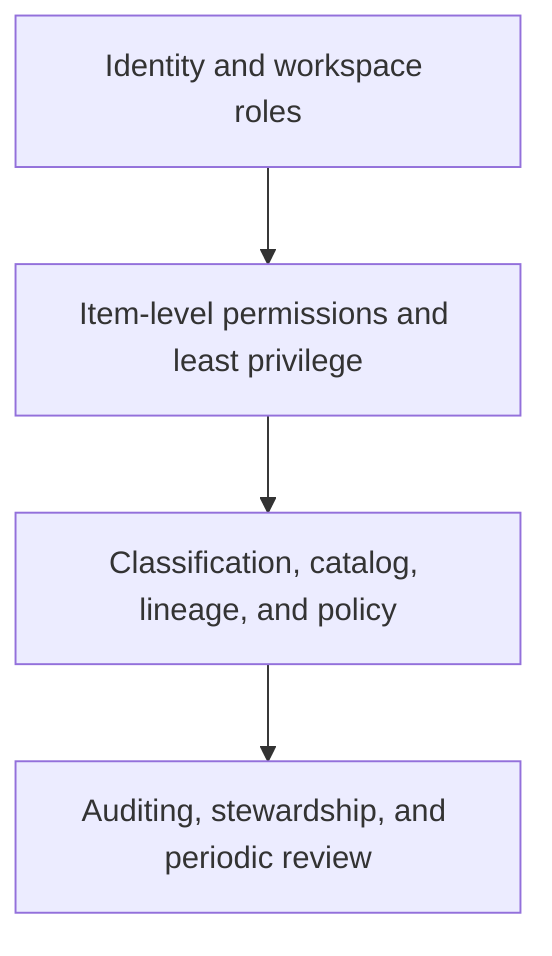

# Govern and secure

Enterprise Fabric governance combines access control, data protection, discoverability, lineage, operational ownership, and auditability. Build these controls into the workspace and item lifecycle rather than trying to reconstruct them after broad adoption.

## Control map

| Control area | Implementation focus |
| --- | --- |
| Identity and access | Use approved identities, workspace roles, and explicit object permissions; avoid unnecessary owner or administrator access. |
| Data protection | Classify sensitive data, apply supported protection mechanisms, and align sharing with data-use policy. |
| Governance | Assign accountable stewards and define data-quality, retention, discovery, and lifecycle expectations. |
| Lineage and catalog | Make critical assets discoverable and traceable through the appropriate Fabric and Purview capabilities. |
| Audit and review | Review access, sharing, configuration, and high-impact changes on a deliberate schedule. |

## Object-specific permissions

The source guides cover permissions for [lakehouses](https://github.com/Cloud2BR-MSFTLearningHub/Fabric-EnterpriseFramework/blob/main/Security/LakehousePermissions.md), [warehouses](https://github.com/Cloud2BR-MSFTLearningHub/Fabric-EnterpriseFramework/blob/main/Security/WarehousePermissions.md), [semantic models](https://github.com/Cloud2BR-MSFTLearningHub/Fabric-EnterpriseFramework/blob/main/Security/SemanticModelsPermissions.md), [dashboards](https://github.com/Cloud2BR-MSFTLearningHub/Fabric-EnterpriseFramework/blob/main/Security/DashboardPermissions.md), [data pipelines](https://github.com/Cloud2BR-MSFTLearningHub/Fabric-EnterpriseFramework/blob/main/Security/DataPipelinesPermissions.md), and other Fabric items. Grant the narrowest role that supports the user or automation task, then validate the effective access with a non-administrator test identity.

## Purview and data governance

Use [Purview guidance in this repository](https://github.com/Cloud2BR-MSFTLearningHub/Fabric-EnterpriseFramework/tree/main/Workloads-Specific/Purview) to plan cataloging, classification, lineage, and policy integration. Confirm the product support boundary and your compliance obligations before treating any governance feature as a complete control implementation.

!!! warning
    Workspace administration, item ownership, sharing, and data access are separate concerns. Do not rely on a broad workspace role where a smaller, supported item-level permission meets the need.