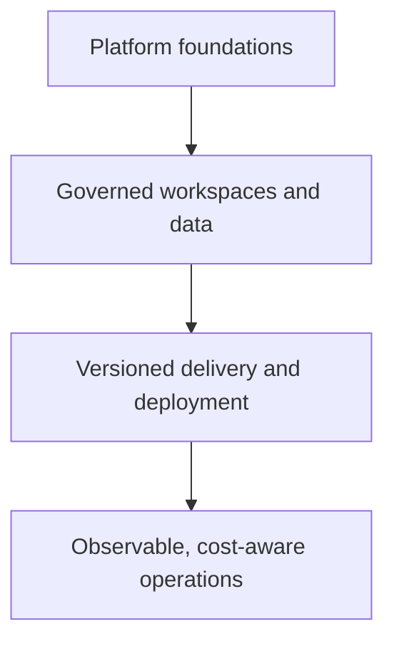

# Microsoft Fabric Enterprise Framework

This learning hub organizes the repository's demos and guides for shaping a well-architected Microsoft Fabric data platform. It connects platform design, workload delivery, governance, security, capacity operations, and cost management into one operating model.

!!! warning
    These materials are demonstrations and guides, not a substitute for official Microsoft support or product documentation. Validate feature availability, tenant settings, licensing, permissions, data-residency requirements, and supported deployment behavior for your environment before rollout.

  <a class="guide-card" href="platform-foundations/"><strong>Platform foundations</strong>Establish tenants, capacities, workspaces, OneLake patterns, and workload boundaries.</a>
  <a class="guide-card" href="govern-and-secure/"><strong>Govern and secure</strong>Apply workspace and item permissions, data protection, lineage, and Purview practices.</a>
  <a class="guide-card" href="deliver-with-confidence/"><strong>Deliver with confidence</strong>Use source control, infrastructure as code, deployment stages, and validation controls.</a>
  <a class="guide-card" href="observe-and-optimize/"><strong>Observe and optimize</strong>Operate capacity, monitor workloads, set alerts, and manage cost deliberately.</a>

## Framework principles

| Principle | Enterprise outcome |
| --- | --- |
| Design for repeatability | Consistent workspaces, policies, and deployment paths across teams and environments. |
| Separate duties and environments | Clear ownership, least privilege, and controlled promotion from development to production. |
| Govern data as a product | Discoverable, classified, lineage-aware assets with accountable stewards. |
| Operate from evidence | Capacity, throttling, refresh, activity, cost, and adoption signals drive decisions. |

## Source material

- [Repository overview](https://github.com/Cloud2BR-MSFTLearningHub/Fabric-EnterpriseFramework/blob/main/README.md)
- [Terraform demos and troubleshooting](https://github.com/Cloud2BR-MSFTLearningHub/Fabric-EnterpriseFramework/tree/main/Terraform)
- [Deployment pipeline demo](https://github.com/Cloud2BR-MSFTLearningHub/Fabric-EnterpriseFramework/tree/main/Deployment-Pipelines)
- [Security and object permissions](https://github.com/Cloud2BR-MSFTLearningHub/Fabric-EnterpriseFramework/tree/main/Security)
- [Monitoring and observability](https://github.com/Cloud2BR-MSFTLearningHub/Fabric-EnterpriseFramework/tree/main/Monitoring-Observability)
- [Workload-specific practices](https://github.com/Cloud2BR-MSFTLearningHub/Fabric-EnterpriseFramework/tree/main/Workloads-Specific)