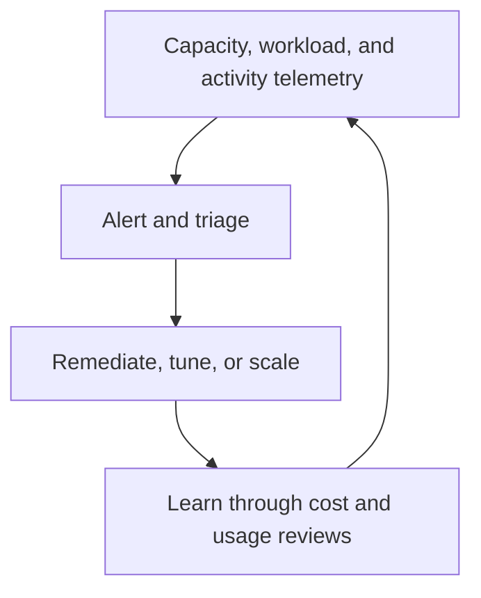

# Observe and optimize

Operate Fabric with evidence from capacity, workload execution, platform activity, data quality, adoption, security, and cost. Monitor the services that users depend on, then connect signals to an owner, response procedure, and capacity or architecture decision.

## Operational signals

| Signal | Why it matters |
| --- | --- |
| Capacity utilization and throttling | Exposes sustained or burst demand, delays, and constrained interactive or background operations. |
| Item and job activity | Helps isolate failures and duration changes in refreshes, pipelines, notebooks, and other operations. |
| Data quality and freshness | Confirms that promoted workloads serve reliable, timely data. |
| Access and governance posture | Reveals whether sharing, classifications, and ownership remain aligned with policy. |
| Cost and adoption | Supports capacity planning, chargeback or allocation discussions, and removal of unused assets. |

## Monitoring tools in the source

The [monitoring guide](https://github.com/Cloud2BR-MSFTLearningHub/Fabric-EnterpriseFramework/blob/main/Monitoring-Observability/MonitorUsage.md) covers the Microsoft Fabric Capacity Metrics app, the Admin Monitoring workspace, Monitor hub, and retention considerations. The [capacity alert guide](https://github.com/Cloud2BR-MSFTLearningHub/Fabric-EnterpriseFramework/blob/main/Monitoring-Observability/StepsCapacityAlert.md) provides a learning path for alerts. Validate prerequisites such as required admin roles and preview support before relying on a feature operationally.

## Cost discipline

Use [cost management references](https://github.com/Cloud2BR-MSFTLearningHub/Fabric-EnterpriseFramework/tree/main/Cost-Management) to connect budgets, alerts, tags, allocation, and reporting to the service owners who can act. Do not optimize solely for lower cost: assess capacity pressure, performance, service-level objectives, and the cost of poor data freshness or reliability.

## Operating rhythm

1. Define alert thresholds and response owners for capacity, failures, latency, data freshness, and access events.
2. Review trends instead of reacting only to individual incidents.
3. Investigate spikes with workspace, item, operation, and deployment context.
4. Test remediation on representative workloads and validate the result in telemetry.
5. Feed learning back into architecture standards, release criteria, capacity plans, and owner runbooks.