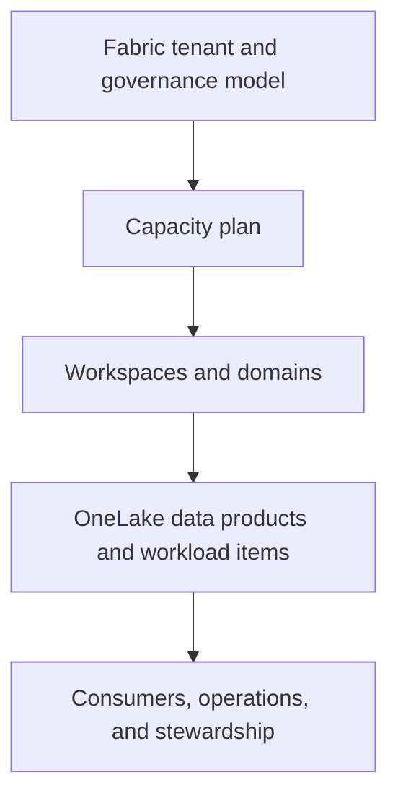

# Platform foundations

Start with a platform model that makes ownership, workload boundaries, capacity, and lifecycle decisions visible. Fabric unifies analytics experiences, but an enterprise design still needs deliberate workspace, capacity, data, and operating boundaries.

## Foundation decisions

| Decision | Questions to resolve |
| --- | --- |
| Capacity | Which workloads share capacity, which need isolation, and how will peak demand and throttling be managed? |
| Workspace model | How are development, test, production, team, and domain responsibilities separated? |
| Data architecture | Which Lakehouse, Warehouse, Real-Time Intelligence, semantic-model, or BI patterns suit each workload? |
| Lifecycle | Who owns an item, how is it changed, and when is it retired or archived? |
| Connectivity | Which approved cloud connections, gateways, identities, and network controls are required? |

## Workload-aware design

The repository includes practices for [Data Factory](https://github.com/Cloud2BR-MSFTLearningHub/Fabric-EnterpriseFramework/tree/main/Workloads-Specific/DataFactory), [Data Engineering](https://github.com/Cloud2BR-MSFTLearningHub/Fabric-EnterpriseFramework/tree/main/Workloads-Specific/DataEngineering), [Data Warehouse](https://github.com/Cloud2BR-MSFTLearningHub/Fabric-EnterpriseFramework/tree/main/Workloads-Specific/DataWarehouse), [Data Science](https://github.com/Cloud2BR-MSFTLearningHub/Fabric-EnterpriseFramework/tree/main/Workloads-Specific/DataScience), [Real-Time Intelligence](https://github.com/Cloud2BR-MSFTLearningHub/Fabric-EnterpriseFramework/tree/main/Workloads-Specific/RealTimeIntelligence), and [Power BI](https://github.com/Cloud2BR-MSFTLearningHub/Fabric-EnterpriseFramework/tree/main/Workloads-Specific/PowerBi). Use the workload's data volume, latency, transformation, consumption, and operating requirements to select patterns.

## Establish a repeatable baseline

1. Define platform owners, data-product owners, workspace administrators, and support escalation paths.
2. Map the target environments, capacities, workspaces, and approved connections before teams begin building.
3. Use infrastructure-as-code where supported to make prerequisite resources and policies reviewable and repeatable.
4. Document naming, tagging, ownership, data classification, lifecycle, and recovery expectations.
5. Pilot a representative workload before standardizing the design broadly.

!!! tip
    A Medallion architecture is a pattern, not a mandate. Apply it when it helps make ingestion, refinement, quality, and serving responsibilities clear; adapt it to the actual workload and data-product contract.